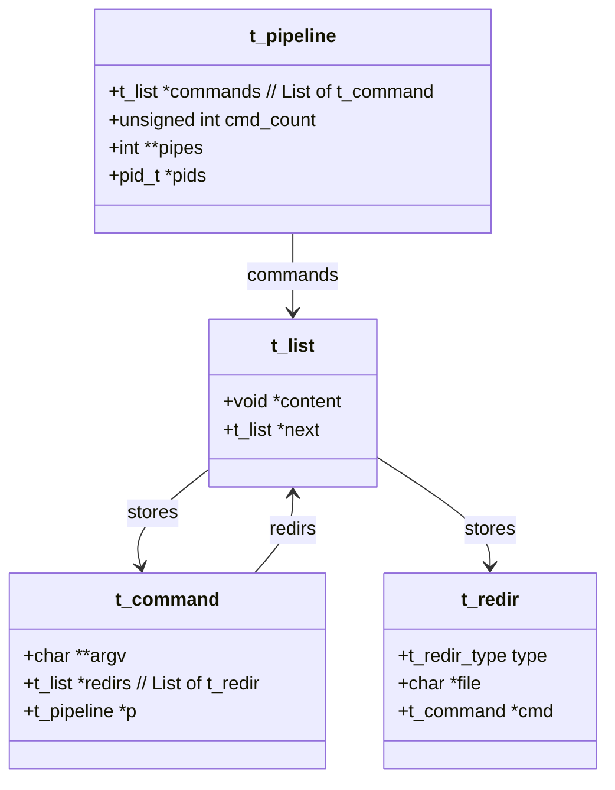
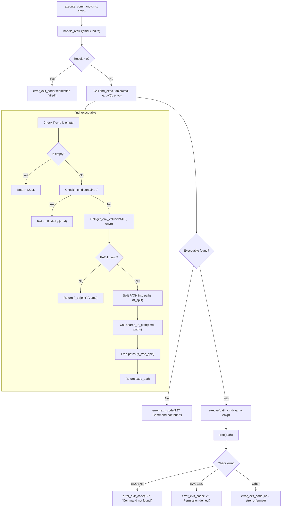
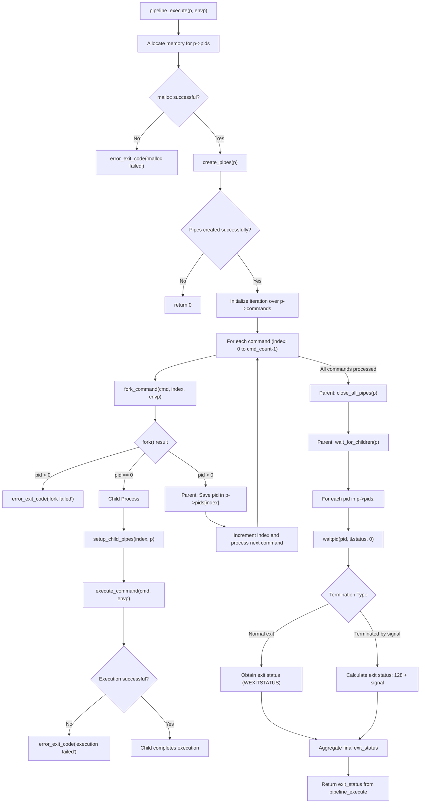
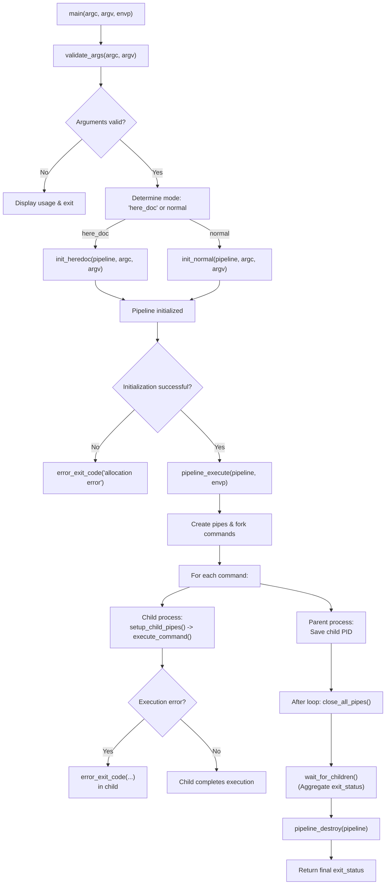

# Pipex

Pipex is a project from 42's Common Core. This is my own implementation that has successfully passed the 42 project requirements. It executes a series of commands connected by pipes, handling input/output redirections (including heredoc), and ensures robust error management and resource cleanup. All memory allocations are centralized in a pipeline structure that is properly freed before the program terminates if initialized.

---

## Table of Contents

- [Features](#features)
- [Cloning](#cloning)
- [Compilation](#compilation)
- [Usage](#usage)
- [Data Structures](#data-structures)
- [Error Management and Resource Handling](#error-management-and-resource-handling)
- [Project Structure](#project-structure)
- [Mermaid Diagrams](#mermaid-diagrams)
- [Repository](#repository)
- [License](#license)

---

## Features

- **Command Execution:** Uses `fork()`, `execve()`, and `pipe()` to build a chain of processes.
- **Redirection Handling:** Implements input, output, append, and heredoc redirections.
- **Error Management:** Centralized error management via `error_exit_code()` ensures that errors are reported and resources are released.
- **Memory Management:** All memory allocations for the pipeline are stored in the pipeline structure and are freed upon termination.
- **Resource Safety:** Always closes file descriptors to avoid leaks and prevent hanging reads/writes.
- **Bonus Mode:** Supports a bonus mode using heredoc input.

---

## Cloning

```bash
git clone --recursive https://github.com/cesardelarosa/pipex.git
```

If you did not clone it with the `--recursive` flag, you can initialize and update submodules manually:

```bash
git submodule init
git submodule update
```

---

## Compilation

To build the standard version, run:
```bash
make
```

To build the bonus version (with heredoc support), run:
```bash
make bonus
```

This will create the `pipex` or `pipex_bonus` executables in the project root.

---

## Usage

### Standard Mode

```bash
./pipex infile "cmd1" "cmd2" outfile
```

### Bonus Mode (with heredoc)

```bash
./pipex here_doc LIMITER "cmd1" "cmd2" ... outfile
```

**Note:** The program validates its arguments and will print a usage message and exit if the required number of arguments is not provided.

---

## Data Structures

This project defines three primary structures in [structs.h](include/structs.h) to organize pipeline data and manage commands:

1. **`t_pipeline`**  
   - Maintains a list of commands (`commands`), the number of commands (`cmd_count`), an array of pipes (`pipes`), and an array of pids (`pids`).  
   - Provides a central place for resource allocation and cleanup.
2. **`t_command`**  
   - Holds the argument list (`argv`), a list of redirections (`redirs`), and a pointer to the parent pipeline (`p`).  
   - Each command can have multiple redirections attached.
3. **`t_redir`**  
   - Describes a redirection with a type (`type`), a file name (`file`), and a reference to the command that owns it (`cmd`).  
   - Supported types include: `REDIR_INPUT`, `REDIR_OUTPUT`, `REDIR_APPEND`, `REDIR_HEREDOC`.

Below is a Mermaid class diagram illustrating the relationships among these structures:



These data structures ensure clear ownership of memory and file descriptors, allowing for robust cleanup in case of errors or normal termination.

---

## Error Management and Resource Handling

- **Error Management:**  
  The function `error_exit_code()` is used throughout the project to print a meaningful error message, free allocated resources (by calling `pipeline_destroy()`), and exit with a specific code.
  
- **File Descriptors:**  
  All file descriptors created (for pipes and redirections) are explicitly closed when no longer needed using helper functions like `close_all_pipes()` and `safe_close()`.
  
- **Memory Management:**  
  All memory allocations are stored in the `t_pipeline` structure. Before the program ends, whether due to successful execution or an error, the pipeline structure is completely freed. This centralization ensures that memory leaks are avoided even if an error occurs.

---

## Project Structure

```
/pipex
├── include/            # Header files for the project
├── libft/              # Libft library (compiled as libft.a)
├── obj/                # Object files (created by the Makefile)
├── src/                # Source files (command creation, execution, error handling, etc.)
├── Makefile            # Build instructions
└── README.md           # This file
```

---

## Mermaid Diagrams

Below are additional Mermaid diagrams that illustrate the key functions and their control flow.

### 1. `execute_command` Flow

This diagram details the process within the execute_command function. It handles the command's redirections and then proceeds to find and execute the appropriate executable. In case of failures (like redirection issues or missing executables), it triggers corresponding error routines.



### 2. `pipeline_execute` Flow

This diagram illustrates the flow of the pipeline_execute function, which is responsible for managing the execution of multiple commands as a pipeline. It covers memory allocation for process IDs, pipe creation, forking for each command, setting up child process pipes, executing commands, and finally waiting for all child processes to finish to aggregate their exit statuses.



### 3. General Program Flow

This diagram outlines the overall control flow of the program starting from the main_bonus function. It demonstrates the initial argument validation, mode determination (whether to run in here_doc mode or normal mode), pipeline initialization, execution of the pipeline, and the subsequent cleanup of resources once execution is complete.



---

## Repository

The complete project is hosted on GitHub:

[github.com/cesardelarosa/pipex](https://github.com/cesardelarosa/pipex)

---

## License

This project is licensed under the GPLv3 License. See the [LICENSE](LICENSE) file for details.
